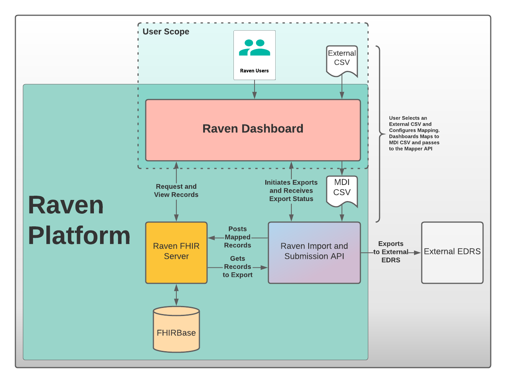

Architecture and Components
===========================

System Overview
---------------

The following diagram is intended to give a general look at the Raven
Platform. Please note that this is not to be considered a strictly
technical architecture diagram for development purposes, and is only
intended to demonstrate a high level view of the functionality of the
system as relates to the physical layout of components, connection to
external end points, and the users’ scope.

Workflow Simulator
------------------
The workflow simulator is an end-to-end framework that manages the project workstreams. Individual components under the Project Workstreams are composed in the workflow simulator.

Case Importing
--------------
Case Importing is a Raven 2.0 feature that imports the Comma-separated Values (CSV) or spreadsheet file into the MDI FHIR server in an MDI FHIR IG compliant format.  
  
The FHIR data model is complicated and structured with multi-levels and logical references. In order to help transitioning from non-FHIR data to MDI IG compliant format, the MDI CSV format was designed. The Case Importing feature maps the pre-defined MDI CSV format to the MDI FHIR IG format and persists them in the MDI FHIR server. 

Validate & Compare
------------------
The MDI (Medicolegal Death Investigation) Validator is a web application that allows users to upload or copy-paste their MDI FHIR IG data for validation. The MDI Validator uses the HL7 FHIR validator as a core validation engine and provides a user interface (UI) wrapper that is tailored to the MDI IG.  
  
The Comparison Tool is a connectathon supporting tool that will compare pre-validated test case MDI FHIR IG data with the user generated FHIR data. Users will want to ensure that not only their data validated but also their contents in FHIR correctly populated. The Comparison Tool will provide a compressed case view with side by-side comparison of the imported record and the correct test case record. This will let users easily hone in on individual content issues and have confidence in their process. 
 
Case Viewer
-----------
The Case Viewer is a UI Component which allows the browsing and viewing of Raven FHIR Server records, encompassing both MDI Case Documents (MDI to EDRS) and Toxicology Reports (LIMS to MDI). In addition to providing a user-friendly option for viewing the data present on the FHIR Server, the layout is structured from the perspective of the MDI Implementation Guide to serve as an educational tool to better understand the data structure and fields which make up the MDI to EDRS and Toxicology to MDI documents. 
  
The Case Viewer also features a FHIR Resource Explorer, which allows users to select a field and see the underlying FHIR Resource structure containing the related data. The FHIR Resource Explorer will support JSON and XML formats, as well as a human readable “narrative view”. 

Raven/Bluejay FHIR Servers
--------------------------
Raven/Bluejay FHIR server is developed to persist MDI FHIR Data and provide the data using FHIR APIs and extended operations. Raven/Bluejay FHIR server includes support for the MDI IG. 
