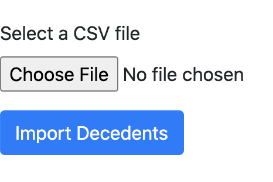

.. _api:

Step 3 - Deploy the Raven Import and Submission API
===================================================

**Note: The Raven Import and Submission API is currently listed under
the “Raven Mapper API” repository and thus will be copied to that
directory. This is a legacy of early implementation, if you have the
“Raven Mapper API” you have the Raven Import and Submission API.**

The Raven Import and Submission API component provides for the Import
(or Mapper) and Submission (or Export) APIs which handle any operations
that need to be performed with the Raven FHIR Server or when interacting
with external systems. To begin, navigate to the “/raven-mapper-api”
directory located where you cloned the Raven Platform repository. An
example of this if you are following this tutorial precisely is provided
in the box below.

::

   # If you are in the "/raven-fhir-server" directory...
   cd ..

   # Once you are back in the "/raven-platform" directory...
   cd raven-mapper-api

Just as with the FHIR server, you will be standing this component up
through Docker using the Dockerfile.local version to follow this
tutorial, in which the environment variables for use here are again
predefined as below.

::

   ENV FHIRCMS_URL=http://raven-fhir-server:8080/raven-fhir-server/fhir
   ENV FHIRCMS_BASIC_USERNAME=client
   ENV FHIRCMS_BASIC_PASSWORD=secret
   ENV CANARY_URL=nightingale.hdap.gatech.edu:8080/
   ENV SERVER_PORT=8081

**Please note that the CANARY_URL variable here points to a Georgia Tech
server for the time being for validation. This should not be used in any
other environment other than this local demo.**

It is also worth noting the formation of the Raven FHIR Server endpoint
utilizes a Docker bridge networking setup, in which the Raven FHIR
Server container can be accessed by the name of the container in the
network as shown. In a non-Docker local deployments, the first instance
of “raven-fhir-server” in the FHIRCMS_URL variable would likely be
replaced by “localhost”.

You may use the following commands to build and then run the container.

::

   sudo docker build -f Dockerfile.local -t raven-import-submit .
   sudo docker run -d --restart unless-stopped --publish 8081:8080 --name raven-import-submit --network=raven-platform raven-import-submit

If you had to make any modifications in earlier steps, you will need to
change the variables and commands accordingly.

Health Check
------------

At this point in the process it is advised to perform a health check on
the system backend components. You should be able to access an import
test endpoint for the Import and Submission API component at
http://localhost:8081/raven-import-and-submit-api.

You may use this interface to import sample data, which is available in
the current directory, in the file “ConnectathonTestCase122221.csv”.
Select the “Choose file” button and then in the file picker select this
sample data. Once selected, you may press the “Import Decedent” button
to begin the process. You will be given an import status screen, which
should show a “Check” next to the line. Now, if you navigate to the
Raven FHIR Server’s FHIR endpoint and look at the Patient resources
available at http://localhost:8080/raven-fhir-server/fhir/Patient you
should be able to find data for the test case.

If you were following this tutorial precisely, everything should be
working. If you made some modifications and something went wrong in this
process, it is recommended that you double check any environment
variables you may have changed in earlier steps and rebuild those
components as needed. If something is not working and you did follow the
tutorial precisely, please file an issue on `our GitHub Issues
page <https://github.com/MortalityReporting/raven-platform/issues>`_.

Continue to :ref:`dashboard`.
