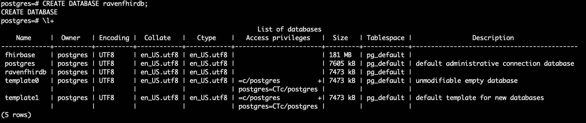

.. role:: raw-latex(raw)
   :format: latex
..

.. _database:

Step 1 - Getting Started and FHIR Database
==========================================

Step 1a) Clone the Raven Platform Repository
--------------------------------------------

To begin, open a Linux terminal. This is included with MacOS and Linux
systems. Windows users will want to install the Windows Ubuntu terminal
or equivalent (please see the prerequisites section for more information
on the Windows Ubuntu terminal). Navigate to the directory you would
like the Raven Platform to reside, then run the following command:

::

   git clone --recurse-submodules https://github.com/MortalityReporting/raven-platform.git

This will create a /raven-platform/ directory which contains a sub
directory for each of the Raven components.

Step 1b) Create a Docker Network
--------------------------------

In order for the various components to connect to one another, you must
set them all up using the same Docker network. To create the network use
the following command:

::

   docker network create raven-platform

Whenever a Raven Platform container is ran you will use a parameter to
connect them to this network.

Step 1c) Setup a Fhirbase Database
----------------------------------

For storing FHIR Resources, you will use Fhirbase. Fhirbase is a
Postgres based database toolkit for FHIR, which you can read more about
at https://www.health-samurai.io/fhirbase.

Deploy Fhirbase
~~~~~~~~~~~~~~~

First, you will pull the latest Fhirbase image from Docker Hub. (Docker
Hub is a central repository for registered Docker images from which you
can run a container. For more information, please visit
https://hub.docker.com/.) To pull the image, run the following
command:

::

   sudo docker pull fhirbase/fhirbase:latest

Now that you have the Fhirbase image pulled to your local machine, you
can startup a container based on that image using the command:

::

   sudo docker run -d -p 3000:3000 -p 5432:5432 --network=raven-platform --name fhir_db --restart unless-stopped fhirbase/fhirbase:latest

This will start the container, mapping the ports from the container to
ports on your localhost. In this case, the ports are kept the same. You
can test that the container is running by going to
http://localhost:3000 in a web browser. This should load the
Fhirbase query UI. (Note: We will not be using this as part of the Raven
Platform. This is entirely to ensure functionality.)

Creating a Database
~~~~~~~~~~~~~~~~~~~

Once you know your container is working, it is time to build the
database.Using the name defined before, you can execute the shell of
your container, allowing you to work directly inside of your container.

::

   sudo docker exec -it fhir_db /bin/bash

Your command line should now indicate you are inside the container by
changing to “postgres@[container ID]:/fhirbase$”.

Now you are inside the container, let’s run some commands to get the
database setup fully. You will be using the PostgreSQL command line
interface psql. PostgreSQL is the open source database upon which
Fhirbase is built. Go ahead and execute the PostgreSQL command as
follows to start the interpreter.

::

   psql

Your command line should now read “postgres=#” and you are ready to
create your database. You are free to name your database whatever you
would like, but something descriptive is strongly recommended. For this
example we will use “ravenfhirdb”. To create a database with this name,
execute the following command:

::

   CREATE DATABASE ravenfhirdb;

If you opted to use a different name, simply replace the name in the
command. Do not neglect to include the semicolon at the end of the
command. Once you have executed the command, Postgres will return
“CREATE DATABASE”. To ensure your database is properly created though,
execute the command:

::

   \l+

This will list the databases available. You should see your newly
created database here.

Once you confirm your database is created, you can exit psql with
::

   \q

You will then use Fhirbase to initialize the database with the FHIR R4
schema. To do so, run the following command, replacing the name of the
database if you used something other than “ravenfhirdb”. This specifies
for Fhirbase to initialize the specified database with FHIR version
4.0.0 (R4).

::

   fhirbase -d ravenfhirdb --fhir=4.0.0 init

You may now exit out of your container using just the command “exit”.

::

   exit

Your Fhirbase database is now setup and you are ready to move on to the
next step! Continue to :ref:`server`.
