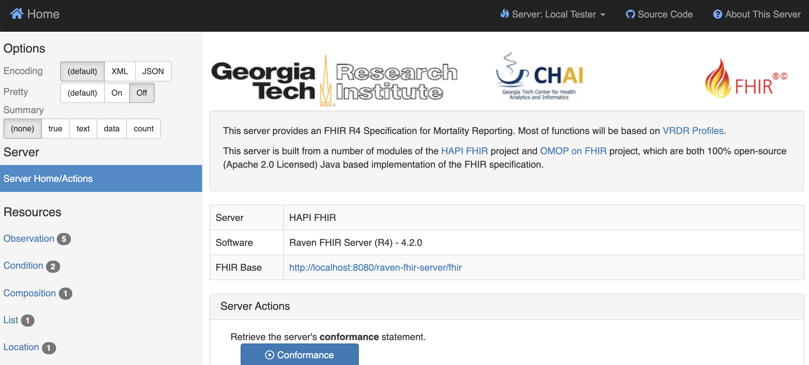

.. _server:

Step 2 - Deploy the Raven FHIR Server
=====================================

Before continuing, ensure that you have followed step 1 and cloned the
Raven Platform GitHub repository, including submodules, to your local
machine.

Navigate to the Raven FHIR Server directory. If you are in the directory
you cloned the repository into, you will likely need to execute the
following commands. (Adjust as needed based on where you are in the
directory structure.)

::

   cd raven-platform
   cd raven-fhir-server

Once you are in the “/raven-fhir-server” directory you can begin, make
not of the available Dockerfiles. If you are unfamiliar with Docker, a
Dockerfile is essentially a script for setting up an environment
template, a Docker image, in which to run an application. The image will
then be used as the foundation for a Docker container which is the
actual miniature environment, very similar to a lightweight Virtual
Machine (it’s not really a VM, but don’t worry about that here). Here
you should have Dockerfile and Dockerfile.local. If you open
Dockerfile.local, you should see the following lines beginning with ENV,
which are preconfigured to follow this deployment guide.

::

   ENV JDBC_URL=jdbc:postgresql://fhir_db:5432/ravenfhirdb
   ENV JDBC_USERNAME="postgres"      
   ENV JDBC_PASSWORD="postgres"
   ENV SMART_INTROSPECTURL="http://localhost:8080/raven-fhir-server/raven-fhir-server/smart/introspect"
   ENV SMART_AUTHSERVERURL="http://localhost:8080/raven-fhir-server/raven-fhir-server/smart/authorize"
   ENV SMART_TOKENSERVERURL="http://localhost:8080/raven-fhir-server/raven-fhir-server/smart/token"
   ENV AUTH_BASIC="client:secret"
   ENV FHIR_READONLY="False"
   ENV INTERNAL_FHIR_REQUEST_URL="http://localhost:8080/raven-fhir-server/fhir"

If you need to adjust something for your local environment in some form,
such as having selected a different name for your database in Step 1,
you should modify the values here. If you are unsure if you need to
change anything, you most likely do not.

Once you are done making any needed changes to your Dockerfile.local (or
the base Dockerfile if you are using it for a more customized setup) and
have saved them, run the following command to build your image. (Do not
neglect the “.” at the end of the line. If you are using the Dockerfile
and not Dockerfile.local, remove the extension shown in the command.)

::

   sudo docker build -f Dockerfile.local -t raven-fhir-server .

You should see output relating to each step of the Docker build process.
Once you have built your image, you can run the container with:

::

   sudo docker run -d --restart unless-stopped --publish 8080:8080 --name raven-fhir-server --network=raven-platform raven-fhir-server

The Raven FHIR Server should now be accessible at
http://localhost:8080/raven-fhir-server. While the server will be
empty for the moment, you should see the FHIR Server UI as in the
screenshot below.

Continue to :ref:`api`.
