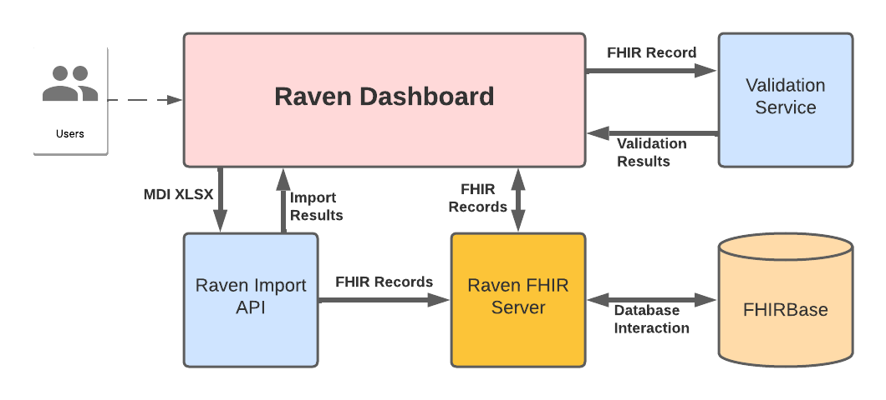

.. _componentOverview:

Component Overview
==================

Raven / Bluejay FHIR Server
---------------------------
Raven platform stores all the MDI case data in the Raven FHIR server and all the EDRS case data in the 
Bluejay FHIR server. Both Raven and Bluejay FHIR server shares the same code stack. Thus, functionally,
they have same capability.

The FHIR server is developed using HAPI FHIR library with fhirbase as a backend database. Basic instance 
level of FHIR APIs are implemented such as, ::

    GET  [base FHIR Url]/Patient/[id] or [search parameters for SEARCH]
    POST [base FHIR Url]/Patient with Patient Resource in the payload
    DELETE [base FHIR Url]/Patient/[id]

In addition to the basic FHIR API, FHIR operation APIs are also implemented for transaction, batch, $document, 
$process-message operations. 

To support MDI-API, FHIR extended operations are implemented as defined in the ":ref:`mdiAPI`"
page. More pieces of information about the Raven FHIR server APIs are available in the ":ref:`ravenAPI`".

Raven Dashboard
-----------------
The Raven Dashboard is the user interface for the Raven Platform. It consists of multiple core modules and features.

* Case Importing and Viewing
   * Import Case Records - Import records to the Raven FHIR Server through and view currently stored case records with the ability to view the underlying FHIR data structures in multiple formats.
* Validte and Compare
   * FHIR Validator - UI wrapper for the official HL7 FHIR Validator command line tool.
   * Record Comparison (In Development) - Compare a user generator FHIR MDI Document bundle created from a test case against a known valid rendering of the same test case.
* Workflow Simulator (In Development) - Move through steps of one of several test scenarios for various MDI related workflows, such as CMS to EDRS or a Toxicology Lab to CMS. The workflow simulator integrates other features.

The Raven Dashboard is a frontend TypeScript project develped using the Angular framework, leveraging major libraries such as Angular Material Design components.

Raven Import API
----------------
The Raven Import API provides a backend service to import test cases from XLSX spreadsheets into the Raven FHIR Server as a FHIR MDI-to-EDRS Document Bundle. The API returns the results of the process to the Dashboard for rendering to users.

Validation Service
------------------
The validation service is a web API which wraps the HL7 command line FHIR validation tool. The Raven Dashboard allows users to post a FHIR resource to the validation service, which returns to the results of the validation.
