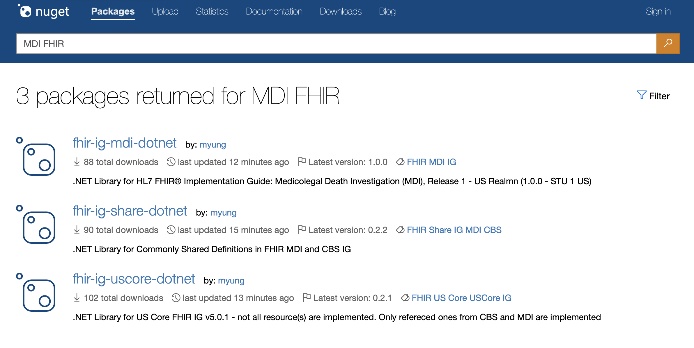

Libraries
=========
Raven provides helper libraries for developers who develop MDI IG functionality in their systems. In fact, Raven
itself is using this library in order to produce and consume the MDI IG data. The libraries are available in
Java and .NET and are also available as an open source. Details for each library are provided below.

MDI JavaLib
------------
This Java Library is for the following FHIR Implemtation Guides (IG)

  - Medicolegal Death Investigation (MDI) FHIR IG | https://build.fhir.org/ig/HL7/fhir-mdi-ig/
  - Occupational Data for Health (ODH) FHIR IG | http://hl7.org/fhir/us/odh/STU1.1/
  - US Core FHIR IG | https://www.hl7.org/fhir/us/core/

The model profiles are built with the annotation package and base model definitions from HAPI-FHIR (https://hapifhir.io/)

MDI Javalib is available as a buildable source package in the MortalityReporting github organization (https://github.com/MortalityReporting/MDI_javalib)

The library is built as a maven project and can be added as a dependency to existing projects (https://maven.apache.org/)

User can use the MDI Javalib to
  - Deserialize JSON or XML into java objects
  - Create new resources from an internal data source
  - Serialize java objects into JSON or XML for transmission

MDI .NET
--------
This .NET Library is for the following FHIR Implementation Guides (IG)

  - Medicolegal Death Investigation (MDI) FHIR IG | https://build.fhir.org/ig/HL7/fhir-mdi-ig/
  - Occupational Data for Health (ODH) FHIR IG | http://hl7.org/fhir/us/odh/STU1.1/
  - US Public Health (US PH) FHIR IG | https://build.fhir.org/ig/HL7/fhir-us-ph-common-library-ig/
  - US Core FHIR IG | https://www.hl7.org/fhir/us/core/

All profiles are built on top of standard .NET FHIR classes (https://github.com/FirelyTeam/firely-net-sdk). 

ODH, US PH, and US Core IGs are base IGs that MDI and CBS IGs are built on. Thus, only referenced 
profiles in US PH, US Core, and ODH are implemented. The rest of the profiles will be added based on the needs.

MDI .NET libraries are available for download from nuget.org. Simply search by "MDI FHIR" at the nuget manager
in Visual Studio. If you want to download from nuget.org, then the link will be 
https://www.nuget.org/packages?q=MDI+FHIR. The result will show up as follow, and C# developers need to install
all four of libraries, 

Source code is also available for developers who are willing to contribute to the IG library developement in .net - https://github.com/MortalityReporting/fhir-ig-dotnet 
