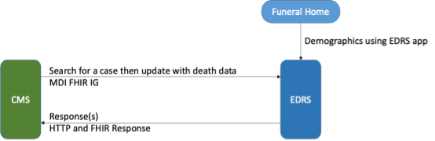

Standard MDI API
================
Operation APIs for MDI
----------------------
MDI Implementation Guide (IG) is available in https://build.fhir.org/ig/HL7/fhir-mdi-ig/index.html. This 
guide should be used for the payload content format.
 
FHIR has also defined the Restful API for operations. The FHIR Restful API document is available from 
https://hl7.org/FHIR/http.html. And, FHIR Restful API Operations are documented in 
https://hl7.org/FHIR/operationslist.html. MDI API is extended operations of the FHIR Restful 
API operations. Thus, the basic rules of FHIR API are also applied to MDI API. For example,

* Content-type for FHIR resources is application/fhir+xml or application/fhir+json. This needs to 
  be specified in the HTTP header. 
* application/x-www-form-urlencoded can be used for POST search requests if HTTP Form is used. 
 
In FHIR, FHIR resources, interactions, and operations are published using CompatibilityStatement 
(GET [base]/metadata). Detailed information about the CompatibilityStatement is available 
in https://hl7.org/FHIR/capabilitystatement.html. It is recommended that EDRS FHIR servers publish 
their capability statement as defined in this link. 

Security
--------
It’s recommended to use OAuth2 with OpenID. EDRS should provide an authorization server to authenticate and 
authorize the CMS to access the EDRS FHIR server. Please refer to http://www.hl7.org/fhir/smart-app-launch/ 
if EDRS wishes to implement SMART on FHIR framework. However, SMART on FHIR is not required.  

The above diagram depicts the MDI to EDRS API workflow. And, the MAPI design will follow this workflow.
Let's first start with the SEARCH operation. In most states, the case is created by funeral directors. 
We will assume that the case has already been created at the EDRS with a decedent's demographics.

SEARCH API
----------
FHIR has search API. However, the FHIR search parameters are specific to a resource. The extended
search queries are complicated. So, MAPI extended the FHIR document generation operation ($document) and 
defined search parameters that represent MDI data elements. Let's first review how MAPI extended the 
'document generation' operation. 

Extended Operation for MDI Document generation
^^^^^^^^^^^^^^^^^^^^^^^^^^^^^^^^^^^^^^^^^^^^^^
This is a resource instance type extended operation. It means that the MDI document is generated from the 
Composition resource. And the extension is made to the extended search parameters.

This is an idempotent operation. Both POST and GET can be used with the following endpoint URL pattern.

 | POST [base FHIR Url]/Composition/$mdi-documents
 | GET  [base FHIR Url]/Composition/$mdi-documents?name1=value1&name2=value2

**Search Parameters for the MDI Document Generation**

+--------------------------+-------------+----------+---------------------------------------------------+
| Name                     | Cardinality | Type     | Documentation                                     |
+==========================+=============+==========+===================================================+
| In Parameters                                                                                         |
+--------------------------+-------------+----------+---------------------------------------------------+
| id                       | 0..1        | uri      | Resource ID of Composition - MDI to EDRS          |
+--------------------------+-------------+----------+---------------------------------------------------+
| patient                  | 0..*        |          | One or more decedent related search parameters    |
+--------------------------+-------------+----------+---------------------------------------------------+
| patient.birthdate        | 0..1        | date     | Decedent's date of birth                          |
+--------------------------+-------------+----------+---------------------------------------------------+
| patient.family           | 0..1        | string   | Decedent's last name                              |
+--------------------------+-------------+----------+---------------------------------------------------+
| patient.given            | 0..1        | string   | Decedent's first name                             |
+--------------------------+-------------+----------+---------------------------------------------------+
| patient.gender           | 0..1        | token    | Decedent's gender                                 |
+--------------------------+-------------+----------+---------------------------------------------------+
| tracking-number          | 0..1        | token    | Search by identifier in Composition - MDI to EDRS |
+--------------------------+-------------+----------+---------------------------------------------------+
| death-location           | 0..1        | string   | District of death location                        |
+--------------------------+-------------+----------+---------------------------------------------------+
| | death-date.actual      | 0..1        | date     | It should be either actual, pronounced, or all    |
| | death-date.pronounced  |             |          | if 'all' is used, then it means searching by both |
| | death-date.all         |             |          | 'actual' and 'pronounced' date of death           |
+--------------------------+-------------+----------+---------------------------------------------------+
| Out Parameters                                                                                        |
+--------------------------+-------------+----------+---------------------------------------------------+
| return                   | 0..1        | resource | Searchset Bundle that includes MDI document       |
|                          |             |          | bundles. If [id] is supplied, then this should be |
|                          |             |          | Bundle - Document MDI to EDRS                     |
+--------------------------+-------------+----------+---------------------------------------------------+

Please note that the Search parameters related to patient are formatted with “.” (dot). In FHIR, this means 
that the search parameters after “.” are *part* of patient parameter in Parameters resource. 
See the example below.

.. code-block:: json-object

    {
    "resourceType": "Parameters",
    "parameter": [
        {
        "name": "patient",
        "part": [
            { 
            "name": "family",
            "valueString": "Hans"
            },
            { 
            "name": "given",
            "valueString": "Kennoby"
            }
        ]
        }
    ]
    }

If [id] is provided within URL path (e.g., /Composition/[id]/$mdi-documents), then the output response 
should be an MDI document bundle as there will be only one or zero result.

If *id* or *search paraemters* is provided in the URL parameter (e.g. [base]/Composition?name=value) 
or Parameters resource in the payload, then the output response should be a *searchset* Bundle resource 
with matching MDI document Bundle resources even if there is only one result. If “OR” search parameter 
is needed in the searching parameters, then as specified in the FHIR specification 
(https://hl7.org/fhir/R4/search.html#escaping), “,” should be used. For example, if we want to search 
records that has death-location equals to either a, b, or c, then its search parameter in Parameters
resource will be like below.

 | “name”: "death-location",
 | “valueString”: “a,b,c”

Please see the examples of search Parameters resource and its response.

**Request**

.. code-block:: json
   :caption: POST FHIRbaseURL/Composition/$mdi-documents
    
   {
   "resourceType": "Parameters",
   "parameter": [
       {
       "name": "patient",
       "part": [
           { 
           "name": "family",
           "valueString": "Hans"
           },
           { 
           "name": "given",
           "valueString": "Kennoby"
           }
       ]
       }
   ]
   }

**Response**

.. code-block:: json

    {
    "resourceType": "Bundle",
    "id": "13ab1ecf-38ce-4f47-aebb-a38396a80775",
    "type": "searchset",
    "total": 1,
    "entry": [
        {
        "resourceType": "Bundle",
        "id": "fd240814-5911-49bb-bb20-72066add4a18",
        "meta": {
            "profile": [
            "http://hl7.org/fhir/us/mdi/StructureDefinition/Bundle-document-mdi-to-edrs"
            ]
        },
        "type": "document",
        "entry": [
         {
            "fullUrl": "Composition/965a0688-e6f4-4bff-a96d-639cbd7ea295",
            "resource": {
                "resourceType": "Composition",
                "id": "965a0688-e6f4-4bff-a96d-639cbd7ea295",
   
            }
         }
         ]
         }
    ]
    }

Error Handling
^^^^^^^^^^^^^^
**API Level Errors**
API itself can indicate errors. API errors are displayed in the HTTP code. 2xx are returned when API 
transactions are successfully processed. 4xx or 5xx are error codes. 3xx are not errors. These codes 
need to be supported at the client side if redirections are required by the server. More details can 
be found from https://en.wikipedia.org/wiki/List_of_HTTP_status_codes. 

CMS must check if the correct endpoint and search parameters are used if such errors are returned. Server
also returns error code when there are document level errors. In this case *OperationOutcome* could be
included in the payload. CMS would want to parse the payload as it contains the source of errors. For
more information about the *OperationOutcome*, see the following section.

**MDI Document Level Errors with 2xx HTTP response**
For all non 2xx status code, error(s) must be indicated in the response with a *OperationOutcome* resource. 

In *OperationOutcome*, EDRS must be include information what caused the error if the error needs to be 
fixed by CMS. If it’s the EDRS that needs to fix the error, it must be indicated so that CMS user(s) can 
contact EDRS for the error. Below shows an example of *OperationOutcome*.

.. code-block:: json
    :caption: HTTP/1.1 500 Internal Server Error

    {
    "resourceType": "OperationOutcome",
    "id": "searchfail",
    "text": {
        "status": "generated",
        "div": "
\n      
        
The &quot;name&quot; parameter has the modifier &quot;exact&quot; which is not supported by 
        this server
\n
"
    },
    "issue": [
        {
        "severity": "fatal",
        "code": "code-invalid",
        "details": {
            "text": "The \"name\" parameter has the modifier \"exact\" which is not supported by this server"
        }
        }
    ]
    }

READ API
--------
| GET [base]/Composition/[id]/$document

[id] is a Composition resource Id, which is assigned by a systems such as CMS and EDRS. If a server maintains
the [id] for all generated FHIR Document Bundles, then this [id] can be used get the document. In this case,
the response is a MDI document Bundle (not a *searchset* Bundle).

If additional information is needed about the base FHIR operation that MAPI operation is extended from, 
please refer to the following link.
https://www.hl7.org/fhir/composition-operation-document.html

UPDATE API
-----------------
During the death investigation, C/ME may need to update the case in the EDRS. This API allows CMS to update
the active case. PUT should be used for the HTTP action method. And, Parameters resource is used to include
the MDI document that C/MEs want to update. Since this API presumes that the case already exists in the
EDRS, the case management system must either make sure identifier(s) is included in the MDI document or 
provide a parameter that EDRS can use to find the case to update.

UPDATE API operations and requirement are as follows.

| PUT [base url]/Composition/$update-mdi
| Payload = Parameters resource

Input/Output Parameters

+------------------------+-------------+----------------------------+---------------------------------+
| Name                   | Cardinality | Type                       | Documentation                   |
+========================+=============+============================+=================================+
| In Parameters                                                                                       |
+------------------------+-------------+----------------------------+---------------------------------+
| Jurisdiction defined   | 0..*        | string                     | Any required parameters for a   |
| parameters             |             |                            | jurisdiction                    |
+------------------------+-------------+----------------------------+---------------------------------+
| edrs-track-number      | 0..1        | string                     | EDRS case number if available   |
+------------------------+-------------+----------------------------+---------------------------------+
| mdi-document           | 0..1        | Bundle                     | MDI document bundle. The        |
|                        |             |                            | “mdi-document” is a reserved    |
|                        |             |                            | keyword. This should only be    |
|                        |             |                            | used for the MDI to EDRS        |
|                        |             |                            | profile bundle document.        |
+------------------------+-------------+----------------------------+---------------------------------+
| Out Parameters                                                                                      |
+------------------------+-------------+----------------------------+---------------------------------+
| return                 | 0..1        | OperationOutcomeParameters | If an error occurs, OO resource |
|                        |             |                            | is returned. If response data   |
|                        |             |                            | need to be sent back,           |
|                        |             |                            | Parameters resource can be used.|
+------------------------+-------------+----------------------------+---------------------------------+

Ex. **Request** in the payload

.. code-block:: json

    {    
    "resourceType": "Parameters",    
    "parameter": [
        { 
        "name": "edrs-track-number",
        "valueString": "1234"
        },        
        { 
        "name": "jurisdiction defined key2",
        "valueString": "value2"
        },
        { 
        "name": "mdi-document",
        "resource": { "MDI document bundle here "}
        }
        ]
    } 

*In Parameters* include parameters that can be used for search and MDI document that has updated information. 
UPDATE API allows custom local search parameters. If there are local search parameters that are required
for the case search, the local search parameters can be defined in the Parameters resource. In the table 
above, this is labeled as "*Jurisdiction defined parameters*". It can be any name and type. However, any 
parameter created by this method would only be supported by systems that can understand the parameter. If 
*Jurisdiction defined parameters* exist but cannot be understood, they should be ignored and NOT cause 
an error.

The MDI document in the search parameter, *mdi-document*, needs to conform to MDI IG profiles.  It is 
not required to include all the data elements in the MDI docvument. Only data elements that need to be 
updated can be included. At the EDRS, empty data elements or missing elments should not be understood as 
DELETE. They should be understood as '*Not Applicable*/. Deleting cases or data elements wihtin a case 
should be handled in a separate API (i.e. DELETE API).

If CMS decided to use the attached MDI document to include search parameters, it is recommended to use
identifier extension(s) in the Composistion resource located in the MDI document entry. MDI IG defines 
tracking numbers in the extended identifiers. Thus, this can be used for searching.

The response for a successful UPDATE API should be 200 OK. The payload is not required. If 
EDRS or CMS needs some data with the response, the Parameters resource can be used. Jurisdiction and 
C/ME office can use the same parameters as *In Parameters* parameters. If the submitted MDI document will 
be included in the response body, then “mdi-document” parameter key should be used. If the API operation was 
successful, but there were some warnings that EDRS wants to send back to CMS, then parameter name 
should be “warning”. And, “resource” should be used to include OperationOutcome resource. If the API 
operations were failed, then the response should be OperationOutcome resource with a HTTP error code. 
Please see the example of response below. 

Ex. **Response** if the operation was successful, and EDRS wanted to respond with updated data.

.. code-block:: json

    {
        "resourceType": "Parameters",    
        "parameter": [
        { 
        "name": "jurisdiction defined key1",
        "valueString": "value1"
        },        
        { 
        "name": "jurisdiction defined key2",
        "valueString": "value2"
        },
        { 
        "name": "mdi-document",
        "resource": { "MDI document bundle" }
        },
        { 
        "name": "warning",
        "resource": { "OperationOutcome resource" }
        }
        ]
    }

**Response** if error occured.

.. code-block:: json

    {
    "resourceType": "OperationOutcome",
    "id": "searchfail",
    "text": {
        "status": "generated",
        "div": "
\n      
The &quot;case number&quot; 1234 does not exist
\n    
"
    },
    "issue": [
        {
        "severity": "fatal",
        "code": "case-invalid",
        "details": {
            "text": "The \"case number\" 1234 does not exist."
        }
        }
    ]
    }

