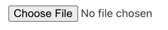
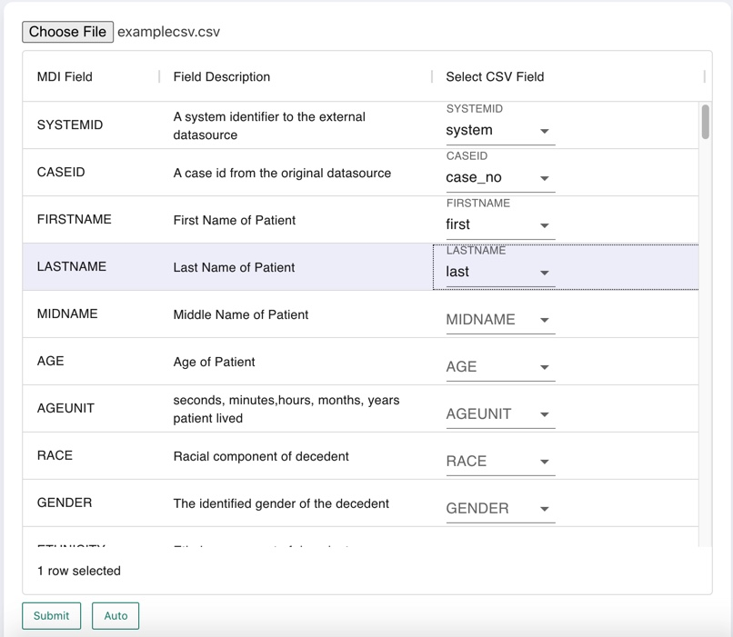

.. _import-data:

Importing Data
==============

Overview
--------

Raven allows users to import their own CSVs containing MDI case data,
which are then mapped into FHIR and stored on the Raven FHIR Server
database. To facilitate this process, Raven uses a curated :ref:`mdi-csv` schema which acts as a go between user data and
FHIR. This simplifies readying user data for conversion into FHIR and
gives users ultimate control over ensuring the meanings of their fields
are properly represented.

If user data does not exist in a CSV format, it must be converted to CSV
before it can be processed by the Dashboard. Most spreadsheet
applications will have an option to either save as or export to CSV.

You must also be able to provide both a System ID and a system unique
Case ID as part of your data. For more information on these fields and
why they are required please see the :ref:`mdi-csv` page.

Submitting a CSV
----------------

You can begin the import process by selecting the “Import CSV” button,
which can be found at the top of the browse cases list or in the top
left corner of the case details screen.

Clicking this will take you to the import page. At the top of the import
page you should see the “Choose File” button, which will open a file
browser dialogue, allowing you to selected your CSV.

Once you have chosen your file, the Raven MDI CSV mapping interface will
be shown.

Mapping your CSV to the Raven MDI CSV schema
--------------------------------------------

The process of mapping is user defined. The Raven Dashboard will provide
three columns containing the Raven MDI CSV Field name, a description of
the intent of the field, and then a drop down box containing all
potential fields in the user submitted CSV.

The screenshot below shows an example of the mapping process, using a
demo CSV with similar but not exact field titles for explanatory
purposes. In the submitted user CSV in this example, it contains fields
(column header names) “system”, “case_no”, “first”, and “last” which all
map cleanly to the Raven MDI CSV “SYSTEMID”, “CASEID”, “FIRSTNAME”, and
“LASTNAME” fields respectively.

*(Please be aware that it is very likely your own data will not map
quite so cleanly for all fields. More complex mapping options are in the
works for continued iterations of the Raven Dashboard.)*

**“SYSTEMID” and “CASEID” are required fields. Attempting to submit your
CSV without selecting a field mapping for those elements will provide an
error message to the user and indicate the issue.**

Once you have completed your mapping, pressing the “Submit” button at
the bottom of the page will attempt to send your CSV to the Raven
Dashboard’s backend which handles this part of the process, wherein the
newly created Raven MDI CSV file will be automatically passed to the
Raven Import API and posted to the FHIR Server. If successful, the
“Submit” button will change text to say “Submitted”.

Your case data should now be viewable using the “Browse Cases” button in
the top left corner of the page, next to where the “Submit CSV” button
was previously.

(*Please note that the “Auto” mapping button and “Download MDI” features
are disabled for the current release of the Raven Platform.*)
