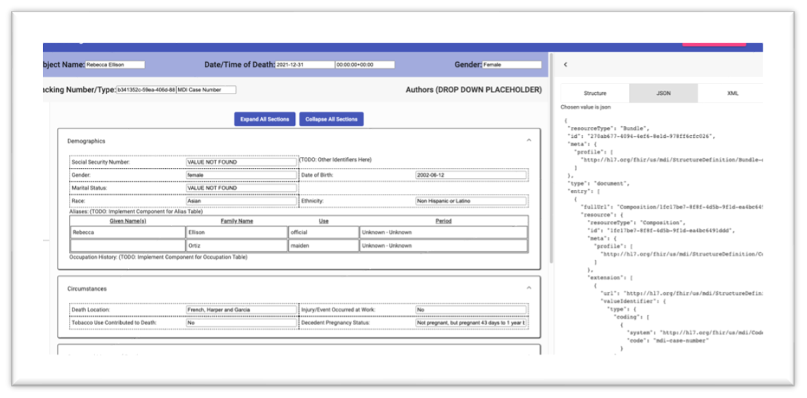

.. _record-management:

Record Management
=================

Case Import (Importing MDI Records)
-----------------------------------
Case Importing is a Raven feature that imports the Comma-separated Values (CSV) or spreadsheet 
file into the MDI FHIR server in an MDI FHIR IG compliant format.  
  
The FHIR data model is complicated and structured with multi-levels and logical references. 
In order to help transitioning from non-FHIR data to MDI IG compliant format, the MDI CSV format 
was designed. The Case Importing feature maps the pre-defined MDI CSV format to the MDI FHIR IG format 
and persists them in the MDI FHIR server. 

.. note::
    **Use Case**: Mapping of any case management system data (in CSV/spreadsheet format) to MDI FHIR and 
    importing them to the Raven FHIR server

For the case importing, a predefined CSV or spreadsheet template is provided to users. Users populate their 
data to the provided template. The user-data will be converted to the MDI FHIR IG data and imported to 
Raven FHIR server.

For connectathon support, the Case Importing feature in Raven will generate reference 
MDI FHIR IG data using connectathon testcase data so that participant-generated MDI FHIR IG data can be 
compared with the reference MDI FHIR IG data with the comparison tool. The case importing and comparing 
data are done as follows. 

**Case Importing** 
    - Reads the testcases spreadsheet
    - Converts the data in the testcases to MDI CSV
    - Mapper maps the MDI CSV to MDI IG FHIR and stores the converted MDI FHIR IG data in the Raven FHIR Server 
      to be used as reference data
    - When connectathon participants’ validated data are loaded to Raven, Comparison Tool compares the 
      loaded data with the reference data. See ":ref:`validation-comparison`" page for more information.

MDI FHIR Document Bundle
^^^^^^^^^^^^^^^^^^^^^^^^
Coming Soon ...

Spreadsheet Schema
^^^^^^^^^^^^^^^^^^
Coming Soon ...

Case Viewer (Viewing Cases)
---------------------------
The Case Viewer is a UI component which allows the browsing and viewing of Raven FHIR Server records, 
encompassing both MDI Case Documents (MDI to EDRS) and Toxicology Reports (LIMS to MDI). 
In addition to providing a user-friendly option for viewing the data present on the FHIR Server, 
the layout is structured from the perspective of the MDI Implementation Guide to serve as an educational 
tool to better understand the data structure and fields which make up the MDI to EDRS and Toxicology to 
MDI documents. 

  
The Case Viewer also features a FHIR Resource Explorer, which allows users to select a field and 
see the underlying FHIR Resource structure containing the related data. The FHIR Resource Explorer will 
support JSON and XML formats, as well as a human readable “narrative view”. 

.. note::
    **Use Case**: Human readable display of MDI FHIR IG data with a FHIR explorer. Any cases loaded in 
    the Raven FHIR server should be retrievable by Case Viewer. Users can use FHIR APIs to load the data.

