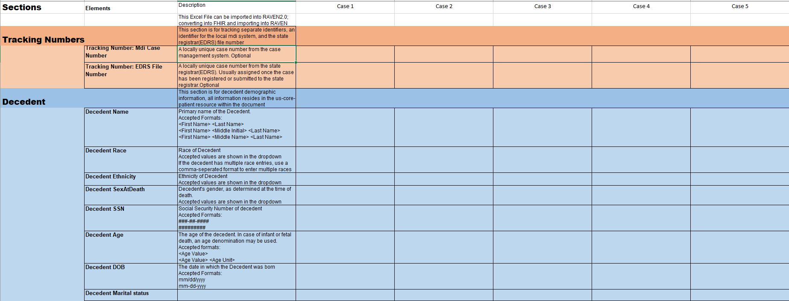

.. _record-management:

Record Management
=================

Case Import (Importing MDI Records)
-----------------------------------
Case Importing is a Raven feature that imports the Comma-separated Values (CSV) or spreadsheet 
file into the MDI FHIR server in an MDI FHIR IG compliant format.  
  
The FHIR data model is complicated and structured with multi-levels and logical references. 
In order to help transitioning from non-FHIR data to MDI IG compliant format, the MDI CSV format 
was designed. The Case Importing feature maps the pre-defined MDI CSV format to the MDI FHIR IG format 
and persists them in the MDI FHIR server. 

.. note::
    **Use Case**: Mapping of any case management system data (in CSV/spreadsheet format) to MDI FHIR and 
    importing them to the Raven FHIR server

For the case importing, a predefined XLSX or spreadsheet template is provided to users. Users populate their 
data to the provided template. The user-data will be converted to the MDI FHIR IG data and imported to 
Raven FHIR server.

For connectathon support, the Case Importing feature in Raven will generate reference 
MDI FHIR IG data using connectathon testcase data so that participant-generated MDI FHIR IG data can be 
compared with the reference MDI FHIR IG data with the comparison tool. The case importing and comparing 
data are done as follows. 

**Case Importing** 
    - Reads the testcases spreadsheet
    - Converts the data in the testcases to MDI CSV
    - Mapper maps the MDI CSV to MDI IG FHIR and stores the converted MDI FHIR IG data in the Raven FHIR Server 
      to be used as reference data
    - When connectathon participants’ validated data are loaded to Raven, Comparison Tool compares the 
      loaded data with the reference data. See ":ref:`validation-comparison`" page for more information.

Spreadsheet Schema
^^^^^^^^^^^^^^^^^^
If the user cannot construct the FHIR records necessary, or are unfamiliar with the FHIR standard in general;
Raven provides an excel spreadsheet XLSX template for easy of use. Users can fill in individual case data as
plaintext values, and use the import case view on the RAVEN platform. RAVEN will transform the XLSX data into
individual FHIR case records that adhere to the FHIR-MDI-IG standard. The template is hosted on the RAVEN
base site; and a `copy can be directly downloaded from the public internet <https://gtvault-my.sharepoint.com/:x:/g/personal/mriley7_gatech_edu/EW6MPoLovyROhAxtk4tjqkkBNzn0SstRhs_g4OOwBhcPIA?e=oL0Ci5>`_.

.. table:: RAVEN Import XLSX Spreadsheet Definitions
    :class: tight-table
    
+---------------------------------+-----------------------------------------------------------------------+-------------------------------------------------------------------------------------------------------------------------------------------------------------------------------------------------------------------+
| Sections                        | Elements                                                              | Description                                                                                                                                                                                                       |
+=================================+=======================================================================+===================================================================================================================================================================================================================+
| Tracking Numbers                |                                                                       | This section is for tracking separate identifiers, an identifier for the local mdi system, and the state registrar(EDRS) file number                                                                              |
+---------------------------------+-----------------------------------------------------------------------+-------------------------------------------------------------------------------------------------------------------------------------------------------------------------------------------------------------------+
| Tracking Numbers                | Tracking Number: Mdi Case Number                                      | A locally unique case number from the case management system. Optional                                                                                                                                            |
+---------------------------------+-----------------------------------------------------------------------+-------------------------------------------------------------------------------------------------------------------------------------------------------------------------------------------------------------------+
| Tracking Numbers                | Tracking Number: EDRS File Number                                     | A locally unique case number from the state registrar(EDRS). Usually assigned once the case has been registered or submitted to the state registrar.Optional                                                      |
+---------------------------------+-----------------------------------------------------------------------+-------------------------------------------------------------------------------------------------------------------------------------------------------------------------------------------------------------------+
| Decedent                        |                                                                       | This section is for decedent demographic information, all information resides in the us-core-patient resource within the document                                                                                 |
+---------------------------------+-----------------------------------------------------------------------+-------------------------------------------------------------------------------------------------------------------------------------------------------------------------------------------------------------------+
| Decedent                        | Decedent Name                                                         | Primary name of the Decedent.Accepted Formats:<First Name> <Last Name><First Name> <Middle Initial> <Last Name><First Name> <Middle Name> <Last Name>                                                             |
+---------------------------------+-----------------------------------------------------------------------+-------------------------------------------------------------------------------------------------------------------------------------------------------------------------------------------------------------------+
| Decedent                        | Decedent Race                                                         | Race of DecedentAccepted values are shown in the dropdownIf the decedent has multiple race entries, use a comma-seperated format to enter multiple races                                                          |
+---------------------------------+-----------------------------------------------------------------------+-------------------------------------------------------------------------------------------------------------------------------------------------------------------------------------------------------------------+
| Decedent                        | Decedent Ethnicity                                                    | Ethnicity of DecedentAccepted values are shown in the dropdown                                                                                                                                                    |
+---------------------------------+-----------------------------------------------------------------------+-------------------------------------------------------------------------------------------------------------------------------------------------------------------------------------------------------------------+
| Decedent                        | Decedent SexAtDeath                                                   | Decedent's gender, as determined at the time of death.Accepted values are shown in the dropdown                                                                                                                   |
+---------------------------------+-----------------------------------------------------------------------+-------------------------------------------------------------------------------------------------------------------------------------------------------------------------------------------------------------------+
| Decedent                        | Decedent SSN                                                          | Social Security Number of decedentAccepted Formats:###-##-#############                                                                                                                                           |
+---------------------------------+-----------------------------------------------------------------------+-------------------------------------------------------------------------------------------------------------------------------------------------------------------------------------------------------------------+
| Decedent                        | Decedent Age                                                          | The age of the decedent. In case of infant or fetal death, an age denomination may be used.Accepted formats:<Age Value><Age Value> <Age Unit>                                                                     |
+---------------------------------+-----------------------------------------------------------------------+-------------------------------------------------------------------------------------------------------------------------------------------------------------------------------------------------------------------+
| Decedent                        | Decedent DOB                                                          | The date in which the Decedent was bornAccepted Formats:mm/dd/yyyymm-dd-yyyy                                                                                                                                      |
+---------------------------------+-----------------------------------------------------------------------+-------------------------------------------------------------------------------------------------------------------------------------------------------------------------------------------------------------------+
| Decedent                        | Decedent Marital status                                               |                                                                                                                                                                                                                   |
+---------------------------------+-----------------------------------------------------------------------+-------------------------------------------------------------------------------------------------------------------------------------------------------------------------------------------------------------------+
| Decedent                        | Decedent Residence: Street                                            | Primary Address of Decedent's residence address. Multiple lines are supported.                                                                                                                                    |
+---------------------------------+-----------------------------------------------------------------------+-------------------------------------------------------------------------------------------------------------------------------------------------------------------------------------------------------------------+
| Decedent                        | Decedent Residence: city                                              |                                                                                                                                                                                                                   |
+---------------------------------+-----------------------------------------------------------------------+-------------------------------------------------------------------------------------------------------------------------------------------------------------------------------------------------------------------+
| Decedent                        | Decedent Residence: county                                            |                                                                                                                                                                                                                   |
+---------------------------------+-----------------------------------------------------------------------+-------------------------------------------------------------------------------------------------------------------------------------------------------------------------------------------------------------------+
| Decedent                        | Decedent Residence: State, U.S. Territory or Canadian Province        |                                                                                                                                                                                                                   |
+---------------------------------+-----------------------------------------------------------------------+-------------------------------------------------------------------------------------------------------------------------------------------------------------------------------------------------------------------+
| Decedent                        | Decedent Residence: Postal Code                                       |                                                                                                                                                                                                                   |
+---------------------------------+-----------------------------------------------------------------------+-------------------------------------------------------------------------------------------------------------------------------------------------------------------------------------------------------------------+
| Decedent                        | Decedent Residence: Country                                           |                                                                                                                                                                                                                   |
+---------------------------------+-----------------------------------------------------------------------+-------------------------------------------------------------------------------------------------------------------------------------------------------------------------------------------------------------------+
| Cause And Manner of Death       |                                                                       | This section is for the information collected in the Cause-and-Manner section of the MDI case document. Data includes* Cause of Death pathway* Manner of Death* Death Date* Injury description and cirumstances   |
+---------------------------------+-----------------------------------------------------------------------+-------------------------------------------------------------------------------------------------------------------------------------------------------------------------------------------------------------------+
| Cause And Manner of Death       | Cause of Death Part I Line a                                          | First line of the cause of death                                                                                                                                                                                  |
+---------------------------------+-----------------------------------------------------------------------+-------------------------------------------------------------------------------------------------------------------------------------------------------------------------------------------------------------------+
| Cause And Manner of Death       | Cause of Death Part I Line b                                          | Second line of the cause of death                                                                                                                                                                                 |
+---------------------------------+-----------------------------------------------------------------------+-------------------------------------------------------------------------------------------------------------------------------------------------------------------------------------------------------------------+
| Cause And Manner of Death       | Cause of Death Part I Line c                                          | Third line of the cause of death                                                                                                                                                                                  |
+---------------------------------+-----------------------------------------------------------------------+-------------------------------------------------------------------------------------------------------------------------------------------------------------------------------------------------------------------+
| Cause And Manner of Death       | Cause of Death Part I Line d                                          | Fourth line of the cause of death                                                                                                                                                                                 |
+---------------------------------+-----------------------------------------------------------------------+-------------------------------------------------------------------------------------------------------------------------------------------------------------------------------------------------------------------+
| Cause And Manner of Death       | Cause of Death Part I Interval, Line a                                | Approximate interval of the first cause of death. A unit of age must be providedAccepted Formats:<Age> <Age Units>                                                                                                |
+---------------------------------+-----------------------------------------------------------------------+-------------------------------------------------------------------------------------------------------------------------------------------------------------------------------------------------------------------+
| Cause And Manner of Death       | Cause of Death Part I Interval, Line b                                | Approximate interval of the second cause of death. A unit of age must be providedAccepted Formats:<Age> <Age Units>                                                                                               |
+---------------------------------+-----------------------------------------------------------------------+-------------------------------------------------------------------------------------------------------------------------------------------------------------------------------------------------------------------+
| Cause And Manner of Death       | Cause of Death Part I Interval, Line c                                | Approximate interval of the third cause of death. A unit of age must be providedAccepted Formats:<Age> <Age Units>                                                                                                |
+---------------------------------+-----------------------------------------------------------------------+-------------------------------------------------------------------------------------------------------------------------------------------------------------------------------------------------------------------+
| Cause And Manner of Death       | Cause of Death Part I Interval, Line d                                | Approximate interval of the fourth cause of death. A unit of age must be providedAccepted Formats:<Age> <Age Units>                                                                                               |
+---------------------------------+-----------------------------------------------------------------------+-------------------------------------------------------------------------------------------------------------------------------------------------------------------------------------------------------------------+
| Cause And Manner of Death       | Cause of Death Part II                                                | Other conributing conditions to the cause of death.If multiple contributing conditions apply, use a comma seperated list.                                                                                         |
+---------------------------------+-----------------------------------------------------------------------+-------------------------------------------------------------------------------------------------------------------------------------------------------------------------------------------------------------------+
| Cause And Manner of Death       | Manner of Death                                                       | Manner of deathAccepted values are shown in the dropdown                                                                                                                                                          |
+---------------------------------+-----------------------------------------------------------------------+-------------------------------------------------------------------------------------------------------------------------------------------------------------------------------------------------------------------+
| Cause And Manner of Death       | Date of Injury                                                        | If an injury occurred leading to death, the date of the injuryAccepted Formats:mm/dd/yyyymm-dd-yyyy                                                                                                               |
+---------------------------------+-----------------------------------------------------------------------+-------------------------------------------------------------------------------------------------------------------------------------------------------------------------------------------------------------------+
| Cause And Manner of Death       | Time of Injury                                                        | If an injury occurred leading to death, the time of the injury. Date of Injury must be completed for time of injury to be accepted.Accepted Formats:hh:mm:sshh:mmhh:mm AM/PM                                      |
+---------------------------------+-----------------------------------------------------------------------+-------------------------------------------------------------------------------------------------------------------------------------------------------------------------------------------------------------------+
| Cause And Manner of Death       | How Injury Occurred                                                   | A text description of the injury.                                                                                                                                                                                 |
+---------------------------------+-----------------------------------------------------------------------+-------------------------------------------------------------------------------------------------------------------------------------------------------------------------------------------------------------------+
| Cause And Manner of Death       | Did Injury Occur at Work?                                             | In the case of an injury, was the injury a part of the decedent's work.Accepted values are shown in the dropdown                                                                                                  |
+---------------------------------+-----------------------------------------------------------------------+-------------------------------------------------------------------------------------------------------------------------------------------------------------------------------------------------------------------+
| Cause And Manner of Death       | Decedent's Transportation Role During Injury                          | If an injury occurred with a vechicle, was the decedent a driver, passenger, or pedestrian?Accepted values are shown in the dropdown                                                                              |
+---------------------------------+-----------------------------------------------------------------------+-------------------------------------------------------------------------------------------------------------------------------------------------------------------------------------------------------------------+
| Death Circumstances             |                                                                       | This section describes specific findings and circumstances related to the decedent's death* Death Location* Injury Location* Death Date* Decedent Pregnancy Status* Tobacco Use Contribute to Death               |
+---------------------------------+-----------------------------------------------------------------------+-------------------------------------------------------------------------------------------------------------------------------------------------------------------------------------------------------------------+
| Death Circumstances             | Location of death                                                     | Full or partial address describing the location of death                                                                                                                                                          |
+---------------------------------+-----------------------------------------------------------------------+-------------------------------------------------------------------------------------------------------------------------------------------------------------------------------------------------------------------+
| Death Circumstances             | Location of Injury                                                    | If an injury occurred, description of location, full, or partial address of the location of injury                                                                                                                |
+---------------------------------+-----------------------------------------------------------------------+-------------------------------------------------------------------------------------------------------------------------------------------------------------------------------------------------------------------+
| Death Circumstances             | Pregnancy status                                                      | Was the decedent pregenant, and how close to term was the decedent?Accepted values are shown in the dropdown                                                                                                      |
+---------------------------------+-----------------------------------------------------------------------+-------------------------------------------------------------------------------------------------------------------------------------------------------------------------------------------------------------------+
| Death Circumstances             | Did Tobacco Use Contribute to Death?                                  | If the decedent used tobacco, did their tobacco use contribute to their cause of death?Accepted values are shown in the dropdown                                                                                  |
+---------------------------------+-----------------------------------------------------------------------+-------------------------------------------------------------------------------------------------------------------------------------------------------------------------------------------------------------------+
| Jurisdiction                    |                                                                       | This section describes jurisdictional findings for the case* Death Date* Pronounced date* Place of death established                                                                                              |
+---------------------------------+-----------------------------------------------------------------------+-------------------------------------------------------------------------------------------------------------------------------------------------------------------------------------------------------------------+
| Jurisdiction                    | Decedent Date of death                                                | The date of death of the decedentAccepted Formats:mm/dd/yyyymm-dd-yyyy                                                                                                                                            |
+---------------------------------+-----------------------------------------------------------------------+-------------------------------------------------------------------------------------------------------------------------------------------------------------------------------------------------------------------+
| Jurisdiction                    | Decedent Time of death                                                | The time of death of the decedent. Decedent date of death must be completed for Decedent Time of death to be acceptedAccepted Formats:hh:mm:sshh:mmhh:mm AM/PM                                                    |
+---------------------------------+-----------------------------------------------------------------------+-------------------------------------------------------------------------------------------------------------------------------------------------------------------------------------------------------------------+
| Jurisdiction                    | Date establishment method                                             | The circumstances of how the date of death was established.Accepted values are shown in the dropdown                                                                                                              |
+---------------------------------+-----------------------------------------------------------------------+-------------------------------------------------------------------------------------------------------------------------------------------------------------------------------------------------------------------+
| Jurisdiction                    | Date pronounced dead                                                  | The date in which the decedent was formally pronounced deadAccepted Formats:mm/dd/yyyymm-dd-yyyy                                                                                                                  |
+---------------------------------+-----------------------------------------------------------------------+-------------------------------------------------------------------------------------------------------------------------------------------------------------------------------------------------------------------+
| Jurisdiction                    | Time pronounced dead                                                  | The time in which the decedent was formally pronounced dead. Date pronounced dead must be completed for Time pronounced dead to be acceptedAccepted Formats:hh:mm:sshh:mmhh:mm AM/PM                              |
+---------------------------------+-----------------------------------------------------------------------+-------------------------------------------------------------------------------------------------------------------------------------------------------------------------------------------------------------------+
| Jurisdiction                    | Place of death                                                        | The type of place the decedent died in (home, hospital, hospice, etc.)Accepted values are shown in the dropdown                                                                                                   |
+---------------------------------+-----------------------------------------------------------------------+-------------------------------------------------------------------------------------------------------------------------------------------------------------------------------------------------------------------+
| Exam-Autopsy                    |                                                                       | This section describes the autopsy findings, if an autopsy occurred.                                                                                                                                              |
+---------------------------------+-----------------------------------------------------------------------+-------------------------------------------------------------------------------------------------------------------------------------------------------------------------------------------------------------------+
| Exam-Autopsy                    | Autopsy Performed?                                                    | Was an autopsy performed on the body?                                                                                                                                                                             |
+---------------------------------+-----------------------------------------------------------------------+-------------------------------------------------------------------------------------------------------------------------------------------------------------------------------------------------------------------+
| Exam-Autopsy                    | Autopsy Results Available?                                            | If an autopsy was performed, are the results available and used to determine the cause of death?                                                                                                                  |
+---------------------------------+-----------------------------------------------------------------------+-------------------------------------------------------------------------------------------------------------------------------------------------------------------------------------------------------------------+
| Chief Medical Examiner/Coroner  |                                                                       | This section describes the primary Chief Medical Examiner or Coroner associated to the case.                                                                                                                      |
+---------------------------------+-----------------------------------------------------------------------+-------------------------------------------------------------------------------------------------------------------------------------------------------------------------------------------------------------------+
| Chief Medical Examiner/Coroner  | Medical Examiner Name                                                 | Name of the Medical Examiner.Accepted Formats:<First Name> <Last Name><First Name> <Middle Initial> <Last Name><First Name> <Middle Name> <Last Name>                                                             |
+---------------------------------+-----------------------------------------------------------------------+-------------------------------------------------------------------------------------------------------------------------------------------------------------------------------------------------------------------+
| Chief Medical Examiner/Coroner  | Medical Examiner Phone Number                                         | Phone number of the office of the Medical Examiner, or primary contact numberAccepted Formats:###-###-####                                                                                                        |
+---------------------------------+-----------------------------------------------------------------------+-------------------------------------------------------------------------------------------------------------------------------------------------------------------------------------------------------------------+
| Chief Medical Examiner/Coroner  | Medical Examiner License Number                                       | Medical Examiner License Number associated to the juridiction in which the case is owned.                                                                                                                         |
+---------------------------------+-----------------------------------------------------------------------+-------------------------------------------------------------------------------------------------------------------------------------------------------------------------------------------------------------------+
| Chief Medical Examiner/Coroner  | Medical Examiner Office: Street                                       | Primary Address of the medical examiner's office or primary address. Multiple lines are supported.                                                                                                                |
+---------------------------------+-----------------------------------------------------------------------+-------------------------------------------------------------------------------------------------------------------------------------------------------------------------------------------------------------------+
| Chief Medical Examiner/Coroner  | Medical Examiner Office: City                                         |                                                                                                                                                                                                                   |
+---------------------------------+-----------------------------------------------------------------------+-------------------------------------------------------------------------------------------------------------------------------------------------------------------------------------------------------------------+
| Chief Medical Examiner/Coroner  | Medical Examiner Office: County                                       |                                                                                                                                                                                                                   |
+---------------------------------+-----------------------------------------------------------------------+-------------------------------------------------------------------------------------------------------------------------------------------------------------------------------------------------------------------+
| Chief Medical Examiner/Coroner  | Medical Examiner Office: State, U.S. Territory or Canadian Province   |                                                                                                                                                                                                                   |
+---------------------------------+-----------------------------------------------------------------------+-------------------------------------------------------------------------------------------------------------------------------------------------------------------------------------------------------------------+
| Chief Medical Examiner/Coroner  | Medical Examiner Office: Postal Code                                  |                                                                                                                                                                                                                   |
+---------------------------------+-----------------------------------------------------------------------+-------------------------------------------------------------------------------------------------------------------------------------------------------------------------------------------------------------------+
| Certifier                       |                                                                       | This section describes the certifier of the case, if the case has been certified. Oftentimes, the Chief Medical Examiner and the Certifier can be the same party. If the case is not certified, leave blank       |
+---------------------------------+-----------------------------------------------------------------------+-------------------------------------------------------------------------------------------------------------------------------------------------------------------------------------------------------------------+
| Certifier                       | Certifier Name                                                        | Name of the Certifier.Accepted Formats:<First Name> <Last Name><First Name> <Middle Initial> <Last Name><First Name> <Middle Name> <Last Name>                                                                    |
+---------------------------------+-----------------------------------------------------------------------+-------------------------------------------------------------------------------------------------------------------------------------------------------------------------------------------------------------------+
| Certifier                       | Certifier Type                                                        | Is the Certifer a Physician, a pronouncer, or other?                                                                                                                                                              |
+---------------------------------+-----------------------------------------------------------------------+-------------------------------------------------------------------------------------------------------------------------------------------------------------------------------------------------------------------+

Record Viewer (Viewing Cases)
---------------------------
The Record Viewer is a UI component which allows the browsing and viewing of Raven FHIR Server records, 
encompassing both MDI Case Documents (MDI to EDRS) and Toxicology Reports (LIMS to MDI). 
In addition to providing a user-friendly option for viewing the data present on the FHIR Server, 
the layout is structured from the perspective of the MDI Implementation Guide to serve as an educational 
tool to better understand the data structure and fields which make up the MDI to EDRS and Toxicology to 
MDI documents. 

.. image:: 
   ../images/case_viewer.png
   :alt: Raven Record Viewer Diagram
  
The Record Viewer also features a FHIR Resource Explorer, which allows users to select a field and 
see the underlying FHIR Resource structure containing the related data. The FHIR Resource Explorer will 
support JSON and XML formats, as well as a human readable “narrative view”. 

.. note::
    **Use Case**: Human readable display of MDI FHIR IG data with a FHIR explorer. Any cases loaded in 
    the Raven FHIR server should be retrievable by Record Viewer. Users can use FHIR APIs to load the data.

