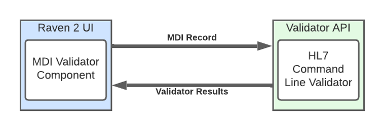

.. _validation-comparison:

Validation And Comparison
=========================
The Validation & ComparisonRaven feature set includes the MDI Validator and the Comparison Tool. The purpose of Validation & Comparison is to confirm MDI record conformance and validity as it is important to connectathon testing and support.

The MDI (Medicolegal Death Investigation) Validator is a web application that allows users to upload or 
copy-paste their MDI FHIR IG data for validation. The MDI Validator uses the HL7 FHIR validator as a core 
validation engine and provides a user interface (UI) wrapper that is tailored to the MDI IG.  
  
The Comparison Tool is a connectathon supporting tool that will compare pre-validated test case MDI FHIR IG 
data with the user generated FHIR data. Users will want to ensure that not only their data validated but also 
their contents in FHIR correctly populated. The Comparison Tool will provide a compressed case view with side 
by-side comparison of the imported record and the correct test case record. This will let users easily hone 
in on individual content issues and have confidence in their process. 

.. note::
    Connectathon Support - validation of user generated MDI FHIR IG data. 

Connectathon participants can enter their FHIR documents into the MDI FHIR IG validator and review any errors. 
The validator confirms the users’ confidence in their external mapping as well as provides a learning 
experience for review and conforming to the IG. 

Archtecture
----------
These would be modules within the Raven Platform or could be used independent of Raven for testing. 
They rely on the Raven FHIR server to serve the data.

