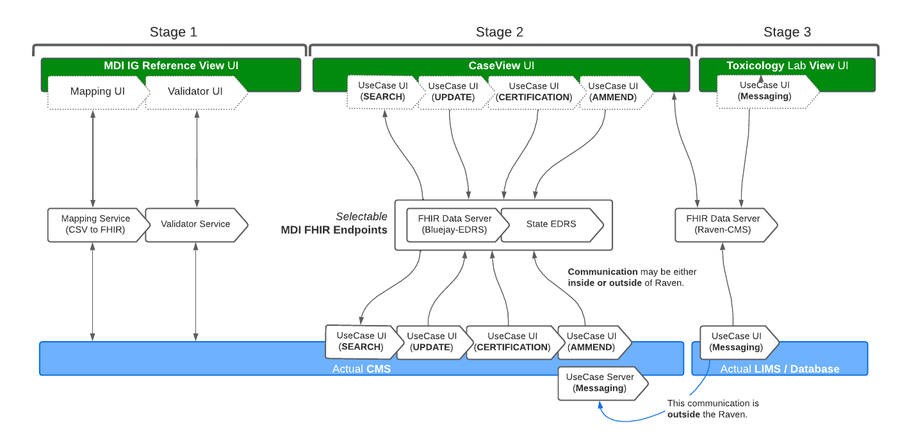

Workflow Simulator
==================
The Workflow Simulator is a modular component of the Raven Testing Tool that enables users to simulate 
dataflows coming into their MDI systems as it relates to FHIR adoption. The simulator also provides users 
clear indicators and metrics to help them make decisions on where to spend their resources as they rebuild 
for modernization and interoperability within their data ecosystems. 

Architecture
------------
This would be a module within the Raven Platform or could be used independent of Raven for testing and metrics.
The following diagram depicts what can be achieved with the collection of modules in staged views. Please note 
that this is not to be considered a strictly technical architecture diagram for development purposes, and is 
only intended to demonstrate a high level view of the functionality of the system as relates to the physical 
layout of components, connection to external end points, and the users’ scope.

   
The workflow simulator is an end-to-end framework that manages the project workstreams. Individual components 
under the Project Workstreams are modularly composed in the workflow simulator.

Value
-----
The Workflow Simulator would play a big part in providing a mechanism for testing the different data flows 
coming into MDI systems. During testing events, we usually have representation from 
State/Jurisdictional/Local Partners but we can lack in vendor participation given the nature of the event. 
For example, it is not likely to have NMS Labs (a lab vendor) or EPIC Systems (an EHR vendor) participate 
in testing data coming from their systems (which could differ based on location) during an HL7 FHIR 
Connectathon. By providing the Workflow Simulator, we can easily simulate these systems for quality testing 
during testing events or independently. It’s important to have quality testing as feedback and support of the 
MDI FHIR IG development but also in support ofimplementation of the standard itself by the community. 

The simulator would also provide a feature that will allow users to see their progress towards adoption of the 
MDI Standard, the completion of US Death Certificate Data and the progress towards modernization within 
their environment. Having the ability to measure, capture and track this information would be quite valuable 
to our user(s)and the CDC for Mortality Reporting. Additionally, it will help to provide traceable metrics 
that would identify gaps in dataflows, tracking of standard adoption, and provide support for funding. This 
will empower CDC and users by providing clear measures of success and progress within the MDI Dataflow, 
which could also be leveraged for VRDR.

Use Cases/Workflows
-------------------
Coming Soon ...

CMS to EDRS
^^^^^^^^^^^
  Step 1 - Import/Select Record

  Step 2 - Validate/Compare

  Step 3 - Configure Endpoint

  Step 4 - API Interaction (Submit)

Future Work
-----------
A medium effort would be needed to complete this effort. Parts of the Workflow Simulator have already been 
built such as the BlueJay Testing Tool used to simulate EDRS communications from an MDI system based on the 
MDI IG Standard. Toxicology Lab Simulation was partially built with the use of a tool called Postman(an API 
platform)which will provide a foundation to be added to the Workflow Simulator. Raven has the ability to be 
“Smart-on-FHIR” enabled, so that it could also simulate communications that could come from an EHR system. 

The Case Status feature would be pretty straight forward as we would be able to provide metrics based on the 
requirements needed to build a US Death Certificate. It could be easily added to the Case Summary Dashboard 
or the Workflow Simulator. The biggest lift is working with NCHS and the community to define metrics to 
track and evaluate. Building the technology to incorporate it within the Workflow Simulator is pretty 
straightforward. 