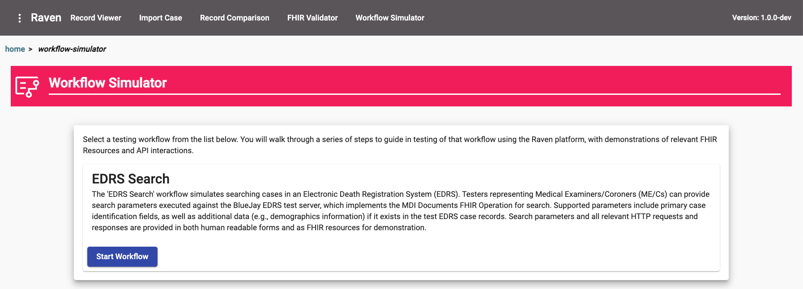

Workflow Simulator
==================
The Workflow Simulator is a modular component of the Raven Testing Tool that enables users to simulate 
data flows coming into their MDI systems as it relates to FHIR adoption. The simulator also provides users 
clear indicators and metrics to help them make decisions on where to spend their resources as they rebuild 
for modernization and interoperability within their data ecosystems. 

Architecture
------------
This would be a module within the Raven Platform or could be used independent of Raven for testing and metrics.
The following diagram depicts what can be achieved with the collection of modules in staged views. Please note 
that this is not to be considered a strictly technical architecture diagram for development purposes, and is 
only intended to demonstrate a high level view of the functionality of the system as relates to the physical 
layout of components, connection to external end points, and the users’ scope.

.. image:: 
   ../images/Raven20Diagram.png
   :alt: Raven Overview Diagram
   
The workflow simulator is an end-to-end framework that manages the project workstreams. Individual components 
under the Project Workstreams are modularly composed in the workflow simulator.

Workflows/Use Cases
-------------------
When opening the Workflow Simulator module, the user will be given a list of currently implemented workflows
to select from. Once selected, the workflow will be loaded, presented as a step by step process in Raven.

Search EDRS (CMS to EDRS)
^^^^^^^^^^^^^^^^^^^^^^^^^
Step 1 - Import/Select Record (Optional)

The first step of the Search EDRS workflow allows the user to select an MDI to EDRS Document from the Raven FHIR Server to use to auto
populate search parameters with the values from the record. Users may also import a record into the workflow as an MDI to EDRS Document
Bundle in the FHIR JSON format. This step is entirely optional, and if a user wishes to proceed without a case select they can
manually input all search parameters required.

.. image:: 
   ../images/workflow-simulator/search-edrs-step1b.png
   :alt: Import MDI to EDRS Document Bundle JSON

Step 2 - Configure Endpoint

After the user decides on whether they would like to use an existing record, they are taken to the Configure Endpoint step. This part of
workflow is the configuration of the FHIR endpoint for testing the search functionality against an Electronic Death Registration System (EDRS).
Users may select between a pre-registered Endpoint or a Custom Endpoint. Pre-registered endpoints are configured in Raven and will typically
provide open testing endpoints, including the Raven BlueJay server which acts as a test EDRS. Selecting a pre-registered endpoint requires no
additional configuration from the user. For custom endpoints, users may provide a non-registered testing endpoint and setup basic authorization
as needed. Custom endpoints are not recorded in any form by the Raven platform, and their use is entirely the responsibility of the user.
Please note that the Raven platform is a single page application based in a web browser, and using custom endpoints may result in the user's
browser recording sensitive information separate from the Raven platform. (This should be managed by the user in coordination with their
organization's internal IT policies.)

Step 3 - Search EDRS (API Interaction)

The final step of the Search EDRS workflow is the execution of search parameters against the identified EDRS endpoint. The potential parameters
fields are data driven and populated automatically based on the FHIR MDI Implementation Guide "MDI Documents" Operation Definition. Users may
select any number of parameter fields they wish to use. If a record was selected or imported during step 1, the parameters will attempt to have
their values automatically populated. As the user enters data or modifies the parameter fields, an example of the FHIR Parameters resource is
shown for demonstration purposes which matches the current state of the parameters HTML form. This allows users building reference
implementations a model to which they can refer in their own development, tying a standard HTML style form to the underlying FHIR resource it
will produce. Once satisified with their search parameters, users may connect to the EDRS and attempt to find matching records.

.. image:: 
   ../images/workflow-simulator/search-edrs-step3a.png
   :alt: Search EDRS Parameters

If records are identified on the EDRS, the results are shown below the parameters. The results can be viewed either as a human readable table
summarizing the matching records, or as a raw FHIR search set bundle. In addition, users can use the HTTP Request and Response tabs to better
be able to identify the headers involved in the HTTP call to the EDRS. In the summary table under the default Results tab, a record may be
selected to load further information.

.. image:: 
   ../images/workflow-simulator/search-edrs-step3b.png
   :alt: Search Results

Once selected in the Results table, the record is displayed below the table. As with the full search results, this can be viewed either as a
human readable summary and as the underyling FHIR MDI to EDRS Document Bundle

.. image:: 
   ../images/workflow-simulator/search-edrs-step3b.png
   :alt: Result Record Summary

